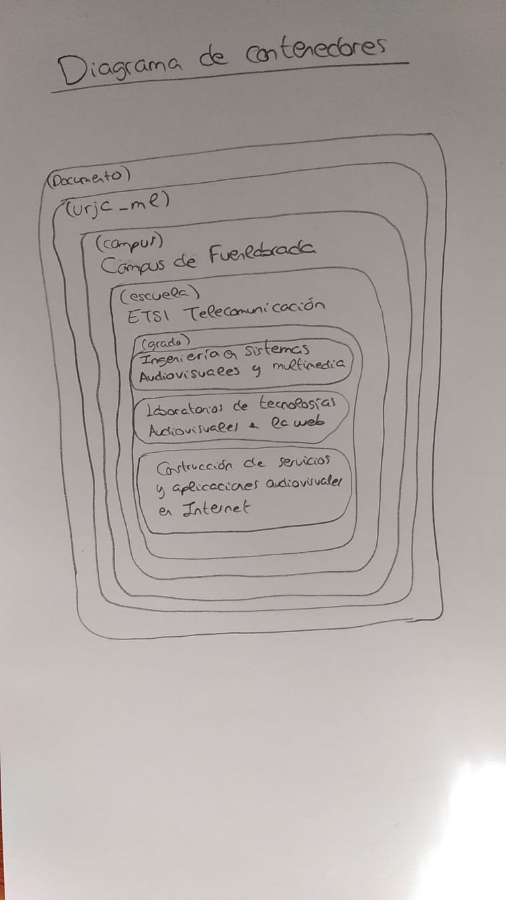
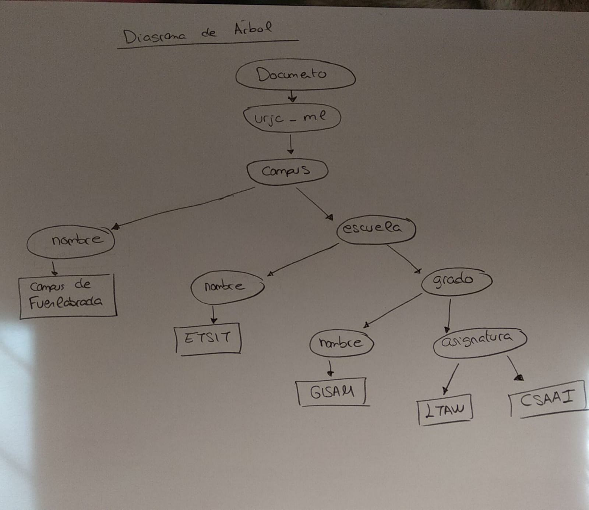

* a) Explica para qué sirve la primera línea del documento y por qué es necesaria
    * sirve para indicar el fichero donde está la definición del lenguaje usado, en este 
     caso urjc_ml

* b) Si se omitiese esta línea, ¿Qué piensas que ocurriría?
   * El documento no podría ser procesado ya que su tipo no estaría definido.

* c) Sin conocer el contenido del fichero urjc_ml.dtd, ¿el documento es sintácticamente correcto?
   * En el documento DTD están definidas las etiquetas de nuestro lenguaje. Sin saber su contendio no tenemos ni idea de si las etiquetas usadas son válidas o no. Por ello NO PODEMOS DETERMINAR si es correcto o no. (Por ejemplo, la etiqueta podría ser que no estuviese definida, o que la etiqueta para definir un nomobre fuese . No lo sabemos)

* d) ¿Qué hace la tercera línea?
   * Es un comentario que a puesto el programador para recordar que tiene que 
    introducir en esa posicion la url de la pagina web de la URJC.

* e) ¿Cuantas etiquetas de apertura hay? ¿Cuantas de cierre?
   * 9 de apertura y 9 de cierre

* f) Dibuja el diagrama de contenedores de este documento
    

* g) Dibuja la estructura en árbol que define este documento
    